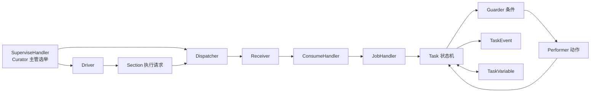
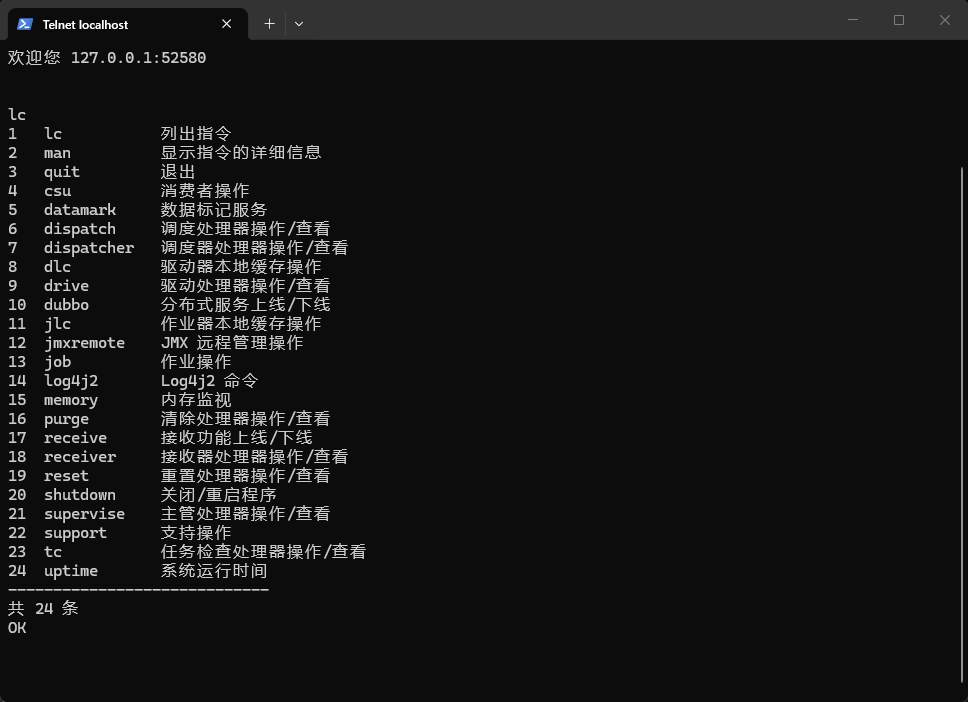
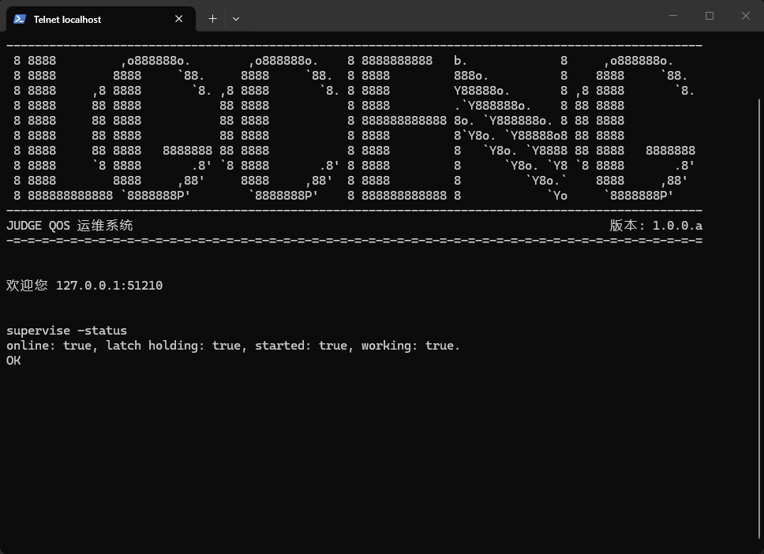

# Logic Engine Introduction - Logic Engine 简介

Logic Engine 是一款开箱即用的逻辑状态机调度与执行框架，面向需要根据触发条件持续推进业务状态、执行状态转移动作的场景，
并支持分布式部署与任务并行执行。

逻辑状态机是一个较为抽象的概念，但在实际应用中有着广泛的应用，例如以下场景：

- 监控设备报警信号，创建报警处置任务，根据处理情况持续流转状态，直至设备恢复正常。
- 按照计划周期创建维护任务，依次经过等待、执行、确认和完成等状态。
- 接收业务事件，根据当前状态和业务条件选择目标状态，并执行通知、记录或控制等动作。

在上述例子中，虽然场景各不相同，但都可以将其抽象为以下过程：

```text
触发条件 -> 创建任务 -> 状态判断 -> 执行动作 -> 状态转移 -> 任务终结
```

Logic Engine 将上述过程中的触发、调度、任务生命周期、状态判断和动作执行拆分为独立机制， 并维护这些机制之间的标准调用流程。

Logic Engine 以部件（Section）为核心。 每个部件可以维护状态（State）、驱动器（Driver）、守卫器（Guarder）和执行器（Performer），
分别定义状态机结构、触发方式、状态转移条件和状态转移动作。

一次 Driver 触发会产生部件执行请求。 主管节点将请求通过 Dispatcher 分发给 Receiver 节点，Receiver 节点创建并执行 Task。
Task 持续运行状态机，直至进入结束状态，或因失败、过期、死亡而终止。

Logic Engine 内置了多种常用的 Driver、Guarder、Performer、Dispatcher、Receiver 和 Pusher 实现，同时提供 SDK 扩展接口，
使用者可以将自定义逻辑接入标准执行流程。对于大量部件或耗时较长的任务，不同 Task 可以分配至多个节点并行执行。

---

## 国际化（I18N）

您正在阅读的文档是中文文档，您可以在 [wiki](..) 目录下找到其他语言的文档。

You are reading the Chinese document. You can find documents in other languages in the [wiki](..) directory.

- [简体中文](./Introduction.md)
- [English](../en-US/Introduction.md)

## 特性

- 实现逻辑状态机的标准化调度与执行流程，将触发、分发、任务执行、状态判断和动作执行拆分为独立机制。
- 以 Section 为状态机配置根，支持初始状态、普通状态和结束状态，以及首次执行冷却和状态轮询间隔。
- 提供完整的 Task 生命周期管理，支持创建、执行、完成、失败、过期和死亡状态， 并使用 TaskEvent 记录时间线、使用 TaskVariable
  维护动态运行上下文。
- 内置 Cron、固定延迟、固定频率和 DCTI Kafka Driver，支持通过 SDK 接入自定义触发逻辑。
- Guarder 按配置顺序判断状态转移条件，第一条成立的 Guarder 决定目标状态； Performer 按顺序执行状态转移动作，全部成功后提交状态转移，并支持自定义
  Guarder 与 Performer。
- 使用 Curator 进行主管选举，由持有主管锁的节点运行 Driver 与 Dispatcher； 支持 In-JVM、Kafka、Dubbo 等 Dispatcher 与
  Receiver 组合，可在单节点和多节点运行形态间切换。
- 通过心跳和任务检查机制识别执行异常，使未及时启动或失去心跳的 Task 收敛到过期或死亡状态。
- 使用 Hibernate 持久化业务实体、Redis 缓存实体数据，并通过进程内本地缓存复用 Section 级状态机执行配置。
- 提供日志、组合和原生 Kafka Pusher，用于推送任务终态、重置和清理等系统事件。
- 提供任务检查、主管、重置、清理、支持重置和本地缓存管理等 QoS 服务，并提供基于 Telnet 的 Telqos 运维平台。

## 系统架构

Logic Engine 的主要运行链路如下：



持有主管锁的节点负责运行 Driver 与 Dispatcher，Receiver 节点负责接收请求并执行 Task。当前版本支持不同 Task 并行执行，但不提供同一 Task 的跨节点接管、恢复、重跑或检查点续跑能力。

## 模块

| 模块                       | 职责                                                                 |
|----------------------------|----------------------------------------------------------------------|
| `logic-engine-stack`       | 定义服务契约、领域实体、DTO、异常、缓存、DAO、Handler 和 Service。   |
| `logic-engine-sdk`         | 提供 Bean 映射、WebInput/FastJson 模型、插件 SDK、常量和校验工具。   |
| `logic-engine-impl`        | 实现 Hibernate、Redis、核心处理器、预设插件、Telqos 指令和运行配置。 |
| `logic-engine-node`        | 节点聚合父模块。                                                     |
| `logic-engine-node-all-he` | 提供完整 Hibernate 节点、启动入口和可执行发布包。                    |
| `logic-engine-distribute`  | 聚合节点发布物，生成最终分发目录。                                   |

## 运行环境

### 核心环境

- Java 8。
- 关系型数据库；`logic-engine-node-all-he` 默认使用 MySQL 与 Hibernate。
- Redis，用于实体缓存和本地运行数据缓存。
- ZooKeeper 与 Curator，用于主管和任务检查等服务的分布式锁。
- Dubbo 与 Snowflake 分布式服务，用于服务暴露、调用和分布式主键生成。

### 可选环境

- Kafka；使用 DCTI Kafka Driver、Kafka Dispatcher/Receiver 或原生 Kafka Pusher 时需要。

## 文档

该项目的文档位于 [docs](../..) 目录下，包括：

### wiki

wiki 为项目开发人员和使用者编写的详细文档，包含不同语言的版本，主要入口为：

1. [简介](./Introduction.md) - 镜像的 `README.md`，与根目录文件内容基本相同。
2. [目录](./Contents.md) - 文档目录。

## 运行截图

Telnet 运维平台指令合集：



在 Telnet 运维平台中查询主管状态：


